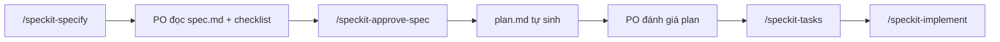

# Quy trình PO — Spec → Plan → Tasks

## Luồng chuẩn



## Bước 1 — Viết spec

```text
/speckit-specify Mô tả tính năng...
```

**Kết quả**: `specs/NNN-feature-name/spec.md` (Status: **Pending PO Review**) + `checklists/requirements.md`.

## Bước 2 — PO chấp thuận spec → sinh plan ngay

Khi PO đồng ý nội dung spec (không còn câu hỏi mở):

```text
/speckit-approve-spec
```

Hoặc nói với agent: **"chấp thuận spec"** / **"spec approved"**.

**Một lệnh này làm hai việc** (cùng phiên làm việc):

1. Ghi nhận **Status: Approved** trong `spec.md`
2. **Tự động chạy** quy trình plan → `plan.md`, `research.md`, `data-model.md`, `contracts/`

PO **không** cần gọi `/speckit-plan` riêng.

## Bước 3 — PO đánh giá plan

Đọc `specs/.../plan.md` (và constitution check). Nếu OK:

```text
/speckit-tasks
```

Nếu plan cần sửa: mô tả feedback → agent cập nhật `plan.md` → PO duyệt lại.

## Bước 4 — Triển khai

```text
/speckit-implement
```

---

**Lưu ý**: `/speckit-clarify` dùng khi spec còn mơ hồ, **trước** `/speckit-approve-spec`.
