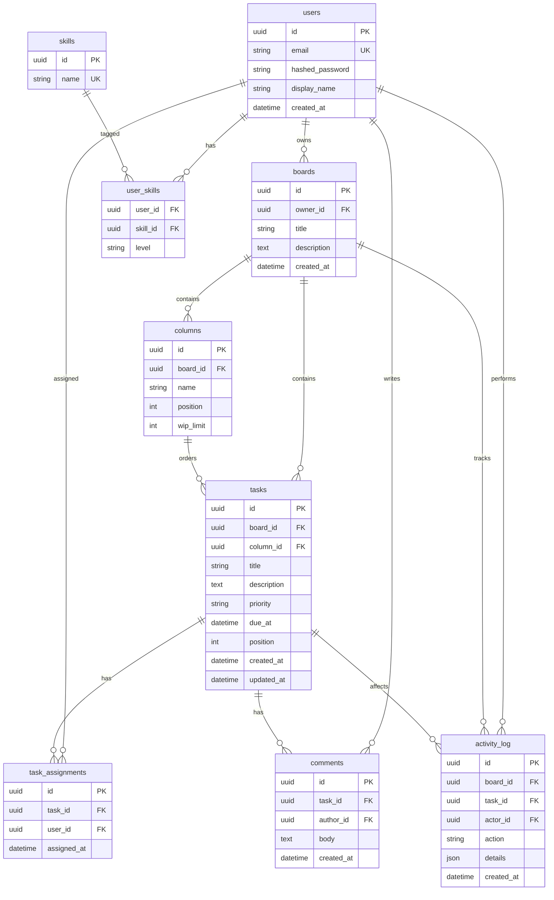

# ERD sơ bộ (Giai đoạn 1)

Ghi chú: `task_assignments` có thể gộp vào `tasks.assignee_id` nếu mô hình 1 người/nhiệm vụ; tách bảng giúp mở rộng nhiều người sau này.

## Sẽ mở rộng ở Phase 2 (xem `docs/phase2-database-design.md`)

- Thêm `tasks.estimate_hours`, `tasks.status` (giữ song song với `column.name` để tiện query không-join), `tasks.tags` (JSON list).
- Bảng `task_dependencies (task_id, depends_on_id)` cho Planner sinh kế hoạch có thứ tự.
- Bảng `agent_runs (id, board_id, intent, status, latency_ms, tokens_in, tokens_out, cost_usd, started_at, finished_at)` để đo P50/P95/cost ở Phase 5.
- Bảng `agent_run_steps (run_id, node, input_json, output_json, started_at, finished_at)` — phục vụ trace UI và evaluation.
- Vector collections (ChromaDB): `task_chunks` (text=title+description, metadata={task_id, board_id, status}), `comment_chunks`, `decision_notes`.
- Alembic baseline migration sẽ thay cho `Base.metadata.create_all` ở `main.py`.

