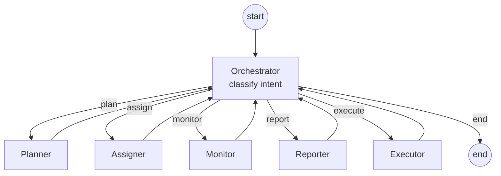

# Phase 2.1 — Kiến trúc Multi-Agent

> Mục tiêu: chốt **roles**, **tools**, **kiểu kiến trúc**, **luồng LangGraph**, **state schema**, **memory** trước khi viết code lõi (Phase 3.4–3.5).

---

## A. Roles (vai trò agent)

| Role | Vị trí trong graph | Trách nhiệm | Output kỳ vọng | Tool gọi (xem mục B) |
|------|---------------------|-------------|----------------|----------------------|
| **Orchestrator** | Supervisor (root) | Phân loại intent của message → quyết định route đến worker nào; quản lý vòng lặp | `intent ∈ {plan, assign, monitor, report, execute, end}` + lý do ngắn | (không) |
| **Planner** | Worker | Bóc tách yêu cầu lớn thành danh sách subtask có thứ tự, ước lượng giờ, gắn skill cần | `tasks: List[TaskDraft]` (title, description, est_hours, required_skills, depends_on) | `search_similar_tasks` |
| **Assigner** | Worker | Gán user phù hợp dựa trên skill match + workload + lịch sử | `assignments: List[{task_id, user_id, score, reason}]` | `get_user_skills`, `get_user_workload`, `assign_task` |
| **Monitor** | Worker | Phát hiện bottleneck: WIP quá WIP-limit, task quá hạn, blocker | `alerts: List[Alert]` (severity, evidence, suggestion) | `query_tasks`, `get_board_activity` |
| **Reporter** | Worker | Tóm tắt board theo khoảng thời gian (daily/weekly), gom theo user/column | `report: {summary, per_user, risks}` | `query_tasks`, `get_board_activity` |
| **Executor** | Worker | Dịch ngôn ngữ tự nhiên thành thao tác CRUD (mở rộng hành động ngoài 4 worker trên) | mảng `tool_calls` đã thực thi + kết quả | mọi mutating tool |

### Lý do tách 5 worker thay vì 1 “super-agent”

1. **Đo được** từng năng lực — Phase 5 ablation rõ (Planner-only vs full).
2. **Prompt ngắn, schema chặt**: ít hallucinate, dễ pin model rẻ cho Worker (xem `phase1-technology-decisions.md` §1.2).
3. **Trace UI rõ**: từng node → một dòng trên panel “AI thinking”.

---

## B. Tool registry

Định nghĩa I/O bằng Pydantic; mọi tool **đọc/ghi DB phải đi qua validation layer** (Phase 3.2).

| Tool | Read/Write | Input (chính) | Output | Người gọi chính |
|------|-----------|---------------|--------|-----------------|
| `query_tasks` | R | `board_id`, `filters`, `limit` | `List[TaskOut]` | Monitor, Reporter |
| `create_task` | W | `board_id`, `column_id?`, `title`, `description`, `priority`, `due_at?`, `est_hours?` | `TaskOut` | Planner (qua Executor), Executor |
| `update_task_status` | W | `task_id`, `column_id` (target) | `TaskOut` | Executor |
| `assign_task` | W | `task_id`, `user_id` | `TaskAssignmentOut` | Assigner |
| `get_user_workload` | R | `user_id`, `board_id?` | `{open_tasks, overdue, in_progress, est_hours_left}` | Assigner |
| `get_user_skills` | R | `user_id` | `List[{skill, level}]` | Assigner |
| `search_similar_tasks` | R (vector) | `query_text`, `top_k=5`, `board_id?` | `List[{task_id, score, snippet}]` | Planner |
| `get_board_activity` | R | `board_id`, `since`, `until` | `List[ActivityLogOut]` | Monitor, Reporter |

> Mỗi tool phải có **decorator** `@tool(requires_permission=...)` để Phase 3 thêm RBAC dựa trên `current_user`.

---

## C. Kiểu kiến trúc — chọn **Hierarchical (Supervisor-Worker)**

### So sánh nhanh

| Pattern | Ưu | Nhược | Phù hợp đồ án? |
|---------|----|-------|----------------|
| **Sequential** | Đơn giản, dễ debug | Cứng nhắc, không phân nhánh theo intent | Không — UI chat cần linh hoạt |
| **Network (mọi agent ↔ mọi agent)** | Linh hoạt | Khó kiểm soát, dễ vòng lặp vô tận, đắt | Không — tăng độ phức tạp đánh giá |
| **Hierarchical** ✅ | 1 supervisor route theo intent → worker chuyên trách → quay về | Cần thiết kế state cẩn thận | **Có** — khớp roles ở mục A |

### Justification (paste được vào báo cáo)

- Yêu cầu hệ thống: nhận **một message NL** → có thể là *plan*, *assign*, *report*, hoặc *exec một câu lệnh*. Supervisor đóng vai trò router.
- Mỗi worker là **single-responsibility** — đo được, prompt ngắn, model rẻ.
- LangGraph hỗ trợ trực tiếp: supervisor là node `Orchestrator`, dùng `add_conditional_edges` từ supervisor đến worker.

---

## D. LangGraph flow (skeleton)



**Quy tắc dừng:** Orchestrator dừng khi (i) `intent == end`, hoặc (ii) `iter_count >= MAX_ITERS` (mặc định 6), hoặc (iii) trace có error không recoverable.

**Streaming:** mỗi lần một worker trả về, `astream_events` (LangGraph) phát event ra WebSocket — frontend render thành dòng trace (xem §F).

---

## E. State schema (TypedDict)

```python
# agents/src/state.py — bản chốt Phase 2
from typing import Annotated, Literal, Optional, TypedDict
from langgraph.graph.message import add_messages
from langchain_core.messages import BaseMessage

Intent = Literal["plan", "assign", "monitor", "report", "execute", "end"]


class AlertItem(TypedDict):
    severity: Literal["info", "warn", "critical"]
    evidence: str
    suggestion: str


class TaskDraft(TypedDict, total=False):
    title: str
    description: str
    est_hours: float
    required_skills: list[str]
    depends_on: list[str]   # tham chiếu title của subtask khác


class AssignmentDecision(TypedDict):
    task_id: str
    user_id: str
    score: float
    reason: str


class AgentState(TypedDict, total=False):
    # I/O
    user_message: str
    board_id: str
    user_id: str                       # actor (người đang chat)
    messages: Annotated[list[BaseMessage], add_messages]

    # Routing
    intent: Intent
    iter_count: int

    # Worker outputs
    plan: list[TaskDraft]
    assignments: list[AssignmentDecision]
    alerts: list[AlertItem]
    report_md: Optional[str]

    # Execution log + trace
    tool_calls: list[dict]            # {tool, args, result, started_at, finished_at}
    error: Optional[str]
```

**Hằng số**: `MAX_ITERS=6`, `MAX_TOOL_CALLS_PER_NODE=5` — tránh vòng lặp khi Orchestrator route loanh quanh.

---

## F. Memory

| Loại | Cơ chế | Mục đích |
|------|--------|----------|
| **Short-term (within run)** | LangGraph `MemorySaver`/`SqliteSaver` checkpoint trên `thread_id = (user_id, board_id)` | Phục hồi khi crash; cho phép “tiếp tục câu hỏi cũ” |
| **Long-term semantic** | ChromaDB collections `task_chunks`, `comment_chunks`, `decision_notes` (Phase 3.3) | Cấp ngữ cảnh cho `search_similar_tasks`; reference cho Reporter |
| **Long-term structured** | Bảng `agent_runs`, `agent_run_steps` (xem `phase2-database-design.md`) | Ghi mọi run để đánh giá Phase 5; phục vụ trace UI |

> Quy ước **xoá sạch session**: client gửi event `reset_thread` → backend xoá checkpoint của thread đó nhưng **giữ** `agent_runs` (audit).

---

## G. Hợp đồng giữa worker & UI

Mọi worker trả về thêm field `display`:

```jsonc
{
  "display": {
    "node": "planner",
    "label": "Planner đã đề xuất 5 subtask",
    "items": [{"title": "...", "est_hours": 3}]
  }
}
```

Frontend chỉ cần render `display`; logic không phụ thuộc nội dung prompt.

---

## H. Definition of Done — Phase 2.1

- [x] Tài liệu này (roles, tools, pattern, mermaid flow, state, memory).
- [ ] Skeleton `agents/src/state.py`, `agents/src/tools/registry.py`, `agents/src/graph.py` compile được (mục §I).
- [ ] Mermaid render được trong Markdown viewer.

## I. Liên kết file Phase 2

- DB / vector / Alembic: `docs/phase2-database-design.md`
- API & WebSocket: `docs/phase2-api-contract.md`
- Evaluation: `docs/phase2-evaluation-framework.md`
- Skeleton code: `agents/src/state.py`, `agents/src/tools/registry.py`, `agents/src/graph.py`
