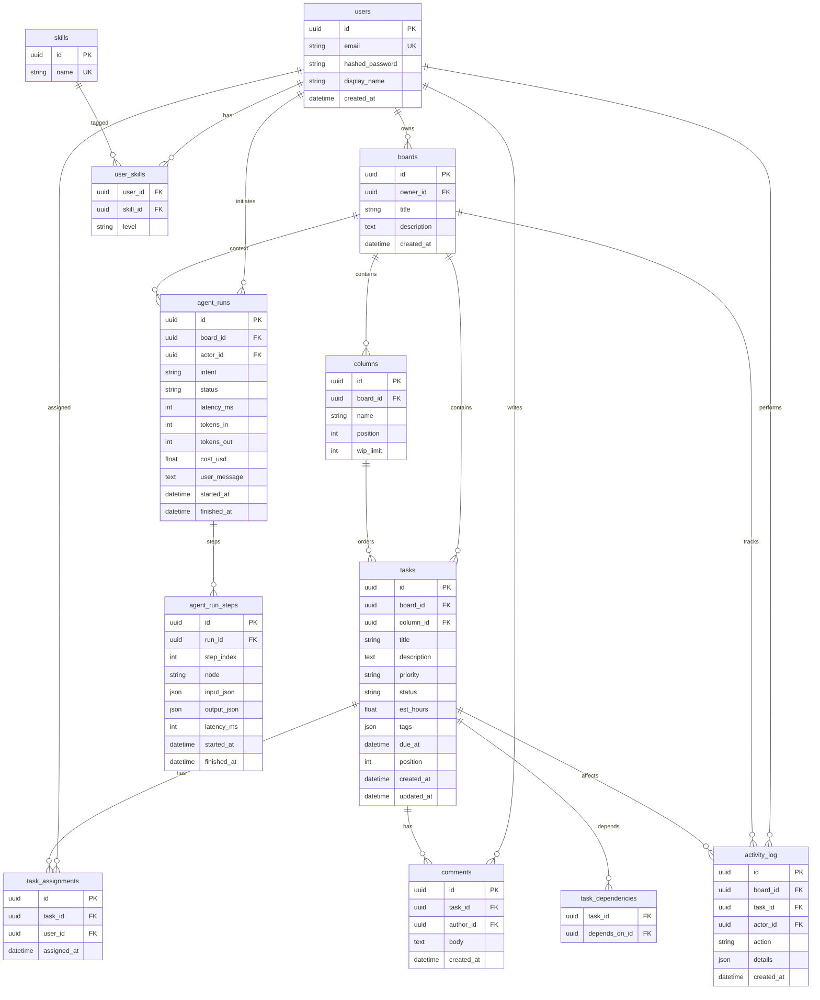

# Phase 2.2 — Database Design

> Mở rộng từ `docs/erd-phase1.md`. Mục tiêu: chốt **schema cuối** (Phase 3 chỉ implement, không thiết kế lại), **vector collections**, **Alembic baseline**.

---

## A. ERD final



### Khác Phase 1 ở chỗ nào?

| Bảng | Thay đổi |
|------|----------|
| `tasks` | Thêm `status` (denormalized từ `column.name`), `est_hours`, `tags` |
| **Mới**: `task_dependencies` | Cho Planner sinh subtask có thứ tự |
| **Mới**: `agent_runs` | Đo P50/P95, cost, success rate (Phase 5) |
| **Mới**: `agent_run_steps` | Lưu trace từng node — phục vụ UI trace + evaluation |

> `status` lưu đôi (column + status) là chủ ý: query nhanh KPI mà không cần join columns; mỗi lần `update_task_status` đồng bộ cả hai.

---

## B. Index quan trọng

| Bảng | Index | Lý do |
|------|-------|-------|
| `tasks` | `(board_id, column_id, position)` | Render board nhanh |
| `tasks` | `(board_id, status, due_at)` | Monitor / Reporter |
| `task_assignments` | `(user_id)` | `get_user_workload` |
| `activity_log` | `(board_id, created_at DESC)` | `get_board_activity` |
| `agent_runs` | `(board_id, started_at DESC)` | Trang "AI history" |
| `agent_run_steps` | `(run_id, step_index)` | Trace UI |

---

## C. Vector collections (ChromaDB)

Persist tại `CHROMA_PERSIST_DIR` (mặc định `./chroma_data` — đã có trong `.env.example`).

| Collection | Document text | Metadata | Khi update |
|------------|---------------|----------|------------|
| `task_chunks` | `f"{title}\n\n{description}"` (chunk 1k token) | `{task_id, board_id, status, priority, tags}` | Khi `create_task` / `update_task` (mô tả/title đổi) |
| `comment_chunks` | `body` | `{comment_id, task_id, board_id, author_id}` | Khi `create_comment` |
| `decision_notes` | nội dung user paste vào panel "decision/note" | `{board_id, author_id}` | Khi user lưu note |

**Pipeline embedding** (Phase 3.3):

1. Subscribe SQLAlchemy event `after_insert/after_update` cho `Task`, `Comment` → push vào queue (in-memory `asyncio.Queue` cho dev, sau này Redis).
2. Worker async lấy doc, chunk (1k token, overlap 100), embed (OpenAI `text-embedding-3-small` hoặc `bge-m3` local), upsert Chroma với `id = f"{task_id}:{chunk_index}"`.
3. Khi delete: xoá theo prefix `id LIKE "{task_id}:%"`.

---

## D. Alembic baseline

### D.1 Cấu trúc

```
backend/
  alembic.ini
  alembic/
    env.py
    versions/
      0001_baseline.py
```

### D.2 Quy trình lập baseline

1. **Bỏ** `Base.metadata.create_all` ở `app/main.py:lifespan` (giữ chỉ trong test).
2. Khởi tạo Alembic: `alembic init alembic`.
3. Sửa `alembic/env.py`:
   - Đọc `settings.database_url` (dùng URL đồng bộ tương đương: `sqlite:///./dev.db` cho SQLite, `postgresql+psycopg://...` cho PG; viết helper convert từ async URL).
   - `target_metadata = app.database.Base.metadata` (import sau khi import models).
4. Sinh baseline: `alembic revision --autogenerate -m "baseline"` → đọc kỹ file revision sinh ra (autogenerate có thể bỏ sót JSON/UUID — chỉnh tay khi cần).
5. Apply: `alembic upgrade head`.

### D.3 Quy ước migration kế tiếp

- Mỗi migration **1 mục đích**, đặt tên `NNNN_short_snake.py`.
- Bắt buộc có `downgrade()` (rollback được); với SQLite dùng `op.batch_alter_table` khi đổi cột.
- Test: chạy `alembic upgrade head && alembic downgrade -1 && alembic upgrade head` không lỗi.

### D.4 Migration kế hoạch ngay sau baseline

| Rev | Mục đích |
|-----|----------|
| `0002_tasks_status_estimate_tags` | Thêm `tasks.status`, `tasks.est_hours`, `tasks.tags` |
| `0003_task_dependencies` | Bảng `task_dependencies` |
| `0004_agent_runs` | Bảng `agent_runs`, `agent_run_steps` + index |

---

## E. Definition of Done — Phase 2.2

- [x] ERD final + index plan trong tài liệu này.
- [x] Pipeline embedding mô tả đủ để Phase 3.3 implement.
- [ ] `alembic init` + revision `0001_baseline` đã commit (sẽ làm đầu Phase 3.1).
- [ ] `models.py` đã thêm field mới (Phase 3.1) — KHÔNG sửa trong Phase 2 để tránh vỡ Phase 1 demo.
