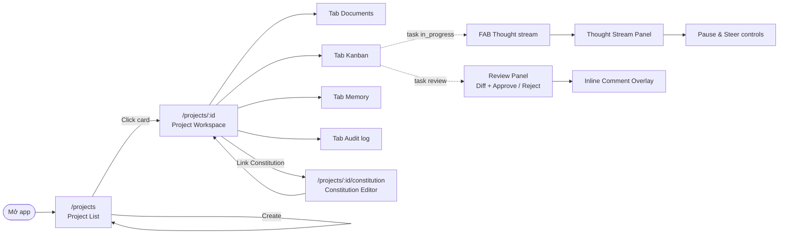
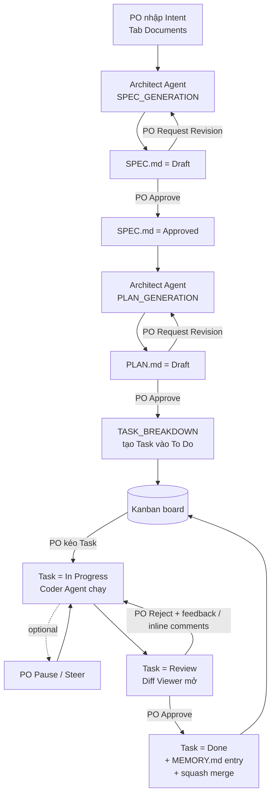

# Đặc Tả Giao Diện (UI Spec) — Neo-Kanban

**Nhánh tính năng**: `001-neo-kanban`
**Ngày tạo**: 2026-05-21
**Trạng thái**: Draft v1
**Phạm vi**: Toàn bộ MVP — Phase 1 (luồng cốt lõi) + Phase 2 (AI nâng cao)
**Tài liệu liên quan**: [spec.md](spec.md) · [plan.md](plan.md) · [contracts/rest-api.md](contracts/rest-api.md) · [contracts/websocket-protocol.md](contracts/websocket-protocol.md)

> Tài liệu này mô tả UI ở mức **wireframe**: bố cục từng vùng, components,
> trạng thái, tương tác. Không có code/CSS. Dùng làm input cho công cụ thiết kế
> Pencil để vẽ artboard cho từng màn và từng state.
> Quy ước: `KB-x` = "Kịch bản x" trong `spec.md`. `YC-xx` = "Yêu cầu chức năng xx".

---

## 1. Tổng Quan & Nguyên Tắc UX

### 1.1 Ngữ cảnh sản phẩm

- **Người dùng duy nhất**: Project Owner (PO). Không có login/đăng ký trong MVP.
- **Triết lý**: PO chỉ đạo Agent qua 1 bảng Kanban + 3 HIL gate (SPEC, PLAN, Code).
  Mọi hành động AI quan trọng đều phải được PO Approve rõ ràng.
- **Luồng một chiều**: To Do → In Progress → Review → Done. Chỉ cho phép Reject
  ngược về In Progress (system-controlled).
- **WIP = 1**: Tối đa 1 Task ở `In Progress` mỗi project tại mọi thời điểm.

### 1.2 Nguyên tắc UX bắt buộc

| # | Nguyên tắc | Hệ quả thiết kế |
|---|------------|----------------|
| N1 | 1 hành động → 1 phản hồi rõ ràng | Mọi thao tác Approve/Reject/Move có badge đổi màu hoặc toast success/error |
| N2 | Không tự động qua HIL gate | Nút Approve luôn hiển thị tách biệt; trạng thái `Draft` không tự thành `Approved` khi PO chỉnh sửa |
| N3 | Hiển thị trạng thái Agent ở mức cao | PO thấy ngay Task có Agent đang chạy / paused / awaiting HIL mà không cần mở panel phụ |
| N4 | Cho phép quan sát chiều sâu khi cần | Thought Stream + Audit log + Memory + Codebase map mở được nhưng không chiếm không gian mặc định |
| N5 | Một-cột-một-mục-tiêu | Mỗi cột Kanban có 1 ý nghĩa (To Do / In Progress / Review / Done / Rejected hoặc Conflict) — không trộn |
| N6 | Hiển thị giới hạn của hệ thống ngay tại UI | Hiển thị "WIP = 1" trên header cột In Progress; thông báo timeout 60 s/10 phút khi xảy ra |
| N7 | Đọc trước, ghi sau | Diff/SPEC/PLAN dùng editor read-only mặc định; PO phải bấm "Edit" hoặc dùng action bar riêng để chỉnh sửa |

### 1.3 Đối tượng thiết bị

- **Desktop-first**, viewport ≥ 1280×800.
- Layout 2-cột cho tab Documents; 3–5 cột cho Kanban (responsive scroll ngang
  khi < 1280 px).
- Floating right-aside Review/Thought Stream chiếm ~480–560 px, đẩy nội dung
  chính sang trái thay vì overlay che (giữ context Kanban).

---

## 2. Bản Đồ Màn Hình & Điều Hướng



### 2.1 Bảng route

| Route | Màn | Mục đích |
|-------|-----|----------|
| `/` | Redirect → `/projects` | — |
| `/projects` | Project List | Liệt kê + tạo dự án |
| `/projects/:id` | Project Workspace (4 tab) | Hub làm việc chính |
| `/projects/:id/constitution` | Constitution Editor | Soạn quy tắc dự án |
| `*` | Redirect → `/projects` | Fallback |

> Floating panels (Review, Thought Stream, Inline Comment, Modal confirm) không
> có route riêng — kích hoạt bằng state trong Workspace.

---

## 3. Bản Đồ Luồng Agentic (HIL Gates)



### 3.1 Các HIL gate

| Gate | Vị trí UI | Hành động chấp thuận | Hành động từ chối |
|------|----------|---------------------|------------------|
| G1 — Duyệt SPEC.md | DocumentPanel (SPEC) | Nút Approve | Textarea feedback + Submit revision |
| G2 — Duyệt PLAN.md | DocumentPanel (PLAN) | Nút Approve | Textarea feedback + Submit revision |
| G3 — Kích hoạt Coder | Kanban: drag Task → In Progress | Drag thành công | Drag bị chặn (WIP) |
| G4 — Duyệt Code | Review Panel (floating) | Nút Approve | Reject textarea + nút Reject (+ inline comments) |
| G5 (P2) — Pause/Resume | Thought Stream footer | Nút Resume + steering textarea | Nút Pause |

---

## 4. Shell Chung (mọi màn)

```
┌───────────────────────────────────────────────────────────────────────┐
│  [Project Header]                                                     │
│   • Tên dự án (link → /projects)                                      │
│   • Tabs: Documents · Kanban · Memory · Audit log                     │
│   • Link "Constitution" (góc phải)                                    │
├───────────────────────────────────────────────────────────────────────┤
│                                                                       │
│                       [Slot nội dung chính]                           │
│                                                                       │
│   ┌─────── (floating, hiện khi có review) ────────────────────────┐   │
│   │ Review Panel (right aside)                                    │   │
│   └───────────────────────────────────────────────────────────────┘   │
│   ┌─────── (floating, hiện khi có in_progress) ──────────────────┐    │
│   │ FAB Thought stream → Thought Stream Panel (right aside)      │    │
│   └──────────────────────────────────────────────────────────────┘    │
│                                                                       │
│  [Toast vùng phải trên — success / error tự ẩn 4–5 s]                 │
└───────────────────────────────────────────────────────────────────────┘
```

### 4.1 Project Header (organism)

- Atoms: link tên dự án, các nút tab, link Constitution, badge ngôn ngữ chính.
- Behavior:
  - Tab active có gạch chân/màu khác; ARIA `role="tablist"`.
  - Hiển thị spinner nhỏ bên cạnh tab Kanban khi có Agent đang chạy (`agent_run.status == 'running'`).
- States: bình thường · loading project metadata · error (banner đỏ thay vị trí tab).

### 4.2 Toast system

- Vị trí: góc phải trên, dưới header ~8 px.
- 3 loại: `success` (xanh lá), `error` (đỏ, click X mới ẩn), `info` (xanh dương,
  auto-dismiss 4 s).
- Trigger ví dụ: "SPEC approved." · "PLAN generation started." · "WIP limit:
  Hoàn thành Task hiện tại trước." (KB-8).

---

## 5. Wireframes Từng Màn

> Mỗi mục có 6 phần cố định: **Khi nào hiển thị · Bố cục · Components · Trạng
> thái UI · Tương tác chính · Mapping**.

### 5.1 Project List — `/projects`

#### Khi nào hiển thị
- Mặc định khi mở app (redirect từ `/`).
- Khi PO bấm "Back to project list" từ Workspace.

#### Bố cục

```
┌─────────────────────────────────────────────────────────────────────┐
│ H1: Projects                                                        │
│ Sub: Create and open Neo-Kanban projects.                           │
│                                                                     │
│ ┌─ New project (form) ─────────────────────────────────────────┐    │
│ │ [Name *           ] [Language ▾ python/javascript/typescript]│    │
│ │ [Description (optional)                                     ]│    │
│ │ (inline error nếu trùng tên / để trống)                     │    │
│ │                                              [Create project]│    │
│ └──────────────────────────────────────────────────────────────┘    │
│                                                                     │
│ (banner đỏ nếu load list lỗi)                                       │
│ (spinner "Loading projects…" khi đang load)                         │
│                                                                     │
│ ┌─ Grid (auto 1–3 cột theo viewport) ──────────────────────────┐    │
│ │ ┌── Card ─────────┐ ┌── Card ─────────┐ ┌── Card ─────────┐  │    │
│ │ │ Project name    │ │ Project name    │ │ Project name    │  │    │
│ │ │ [lang][status]  │ │ [lang][status]  │ │ [lang][status]  │  │    │
│ │ │ Updated …       │ │ Updated …       │ │ Updated …       │  │    │
│ │ │ description…    │ │ description…    │ │ description…    │  │    │
│ │ └─────────────────┘ └─────────────────┘ └─────────────────┘  │    │
│ └──────────────────────────────────────────────────────────────┘    │
└─────────────────────────────────────────────────────────────────────┘
```

#### Components

- Atoms: `TextInput` (Name, Description), `Select` (Language), `Button` primary
  (Create), `Spinner`, `Badge` (status / language).
- Molecules: `Project Card` (title → Link `/projects/:id`, meta row gồm
  language + status + updated time, mô tả 2 dòng truncate).
- Organisms: `New project form` (validate inline), `Project grid`.

#### Trạng thái UI

| State | Mô tả |
|-------|------|
| Loading | Spinner + nhãn "Loading projects…" thay vị trí grid |
| Empty | Text "No projects yet. Create one above." dưới form |
| Normal | Grid card |
| Form error | Inline error đỏ ngay dưới form (tên rỗng / trùng tên — KB-1) |
| Network error | Banner đỏ nguyên hàng phía trên grid |
| Creating | Nút Create đổi nhãn "Creating…" + disabled |

#### Tương tác chính

| Hành động | Kết quả UI | API |
|----------|-----------|-----|
| Submit form hợp lệ | Card mới xuất hiện trong grid + clear form | `POST /api/v1/projects` |
| Click card | Điều hướng tới `/projects/:id` | — |
| Submit tên trùng | Inline error "A project with this name already exists." | `409` từ API |

#### Mapping

- KB-1, KB-2 · YC-01, YC-02, YC-03, YC-04.

---

### 5.2 Constitution Editor — `/projects/:id/constitution`

#### Khi nào hiển thị
- PO bấm link "Constitution" từ Project Header.

#### Bố cục

```
┌─────────────────────────────────────────────────────────────────────┐
│  [← Back to workspace]   Constitution — <project name>              │
│  Sub: Quy tắc Markdown sẽ được đưa vào ngữ cảnh Agent.              │
│                                                                     │
│  ┌─ Monaco Markdown editor (~70vh) ─────────────────────────────┐   │
│  │ # Rules for this project                                     │   │
│  │ - …                                                          │   │
│  │ - …                                                          │   │
│  │                                                              │   │
│  └──────────────────────────────────────────────────────────────┘   │
│                                                                     │
│  [Discard changes]  [Save]   • Last saved: 19:33                    │
└─────────────────────────────────────────────────────────────────────┘
```

#### Components

- Monaco Markdown editor (full-width, ~70vh).
- Atoms: `Button` Save (primary) + Discard (secondary).
- Atoms: `Text` "Last saved: HH:MM" auto cập nhật sau khi lưu.

#### Trạng thái UI

| State | Mô tả |
|-------|------|
| Loading | Spinner overlay trên editor |
| Normal | Nội dung load xong, Save disabled khi chưa thay đổi |
| Dirty | Save enabled, hiển thị "Unsaved changes" cạnh nút |
| Saving | Save đổi nhãn "Saving…" + spinner |
| Saved | Toast "Constitution saved." + cập nhật "Last saved" |
| Empty | Editor trống (placeholder hint: "Viết quy tắc bằng Markdown…") |
| Error | Banner đỏ phía trên editor; giữ nội dung user đang gõ |

#### Tương tác chính

| Hành động | Kết quả |
|----------|--------|
| Gõ nội dung | State chuyển Dirty |
| Save | Lưu qua `PUT /projects/:id/constitution`, hiện toast |
| Discard | Reset về bản đã lưu (sau confirm nhỏ nếu dirty) |
| Back | Quay về `/projects/:id` (cảnh báo nếu dirty) |

#### Mapping

- KB-3 · YC-05, YC-06.

---

### 5.3 Project Workspace Shell — `/projects/:id`

#### Khi nào hiển thị
- Khi PO click card hoặc deep-link.

#### Bố cục

```
┌─────────────────────────────────────────────────────────────────────┐
│ ProjectHeader (5.4 shell common)                                    │
├─────────────────────────────────────────────────────────────────────┤
│ (Review Panel slot — chỉ render khi có task review)                 │
├─────────────────────────────────────────────────────────────────────┤
│ Tab nav: [Documents] [Kanban] [Memory] [Audit log]                  │
├─────────────────────────────────────────────────────────────────────┤
│                                                                     │
│  [Nội dung tab đang chọn — 5.4 / 5.5 / 5.6 / 5.7]                   │
│                                                                     │
│   ┌──── FAB "Thought stream" (góc dưới phải) ────┐                  │
│   │  hiện khi có task in_progress                │                  │
│   └──────────────────────────────────────────────┘                  │
│                                                                     │
│  [Link "Back to project list"]                                      │
└─────────────────────────────────────────────────────────────────────┘
```

#### Components & states

- Tab nav: 4 nút, ARIA `aria-selected`. Tab mặc định = `Documents`.
- Loading project info: spinner toàn shell + "Loading workspace…".
- Error: banner đỏ thay nội dung chính, không xóa header.
- Khi `columns.review.length > 0` → render `Review Panel` floating.
- Khi `columns.in_progress.length > 0` → render FAB "Thought stream".

#### Tương tác chính

- Đổi tab → swap nội dung, giữ Review/Thought panel.
- FAB → mở Thought Stream Panel (5.9).

#### Mapping

- KB-2, KB-4..16. Là khung chứa các màn 5.4–5.12.

---

### 5.4 Tab Documents (SPEC + PLAN)

#### Khi nào hiển thị
- Tab mặc định khi vào Workspace.

#### Bố cục (2 cột song song khi ≥ 1280 px)

```
┌── SPEC.md panel ───────────────┐  ┌── PLAN.md panel ──────────────┐
│ Title + [Badge: Draft/         │  │ Title + [Badge]               │
│ Approved/Revision Requested]   │  │                               │
│                                │  │                               │
│ ─ Nếu chưa có SPEC ─           │  │ ─ Nếu SPEC chưa approved ─    │
│ Label "Intent"                 │  │ Banner: "Approve SPEC để bật  │
│ [Textarea Intent ≥10 ký tự]    │  │  Generate PLAN."              │
│ [Generate SPEC]  (spinner khi  │  │                               │
│                  đang chạy)    │  │ ─ Nếu SPEC approved & PLAN    │
│ Hint: "No SPEC document yet."  │  │   chưa có ─                   │
│                                │  │ [Generate PLAN]  + spinner    │
│ ─ Nếu đã có SPEC ─             │  │ Hint: "SPEC is approved.      │
│ Monaco read-only Markdown      │  │ Generate PLAN.md from         │
│ editor (≤55vh)                 │  │ approved SPEC."               │
│ Overlay "Generating…" khi      │  │                               │
│ Agent chạy lại                 │  │ ─ Nếu PLAN đã có ─            │
│                                │  │ Monaco read-only editor       │
│ HIL action bar:                │  │ HIL action bar (như SPEC)     │
│  [Approve]                     │  │                               │
│  Label "Request revision"      │  │                               │
│  [Textarea feedback]           │  │                               │
│  [Submit revision]             │  │                               │
│                                │  │                               │
│ [Refresh]                      │  │ [Refresh]                     │
└────────────────────────────────┘  └───────────────────────────────┘
```

#### Components

- Molecules: `DocumentEditor` (Monaco Markdown read-only).
- Organisms: `DocumentPanel` (mỗi `SPEC`/`PLAN` 1 instance).
- Atoms: `Badge` 3 màu (Draft = xám, Approved = xanh lá, Revision Requested =
  cam), `Textarea` (intent / feedback), `Button` primary + secondary.

#### Trạng thái UI mỗi panel

| State | Mô tả |
|-------|------|
| `list_loading` | Spinner + "Loading documents…" |
| `list_error` | Banner đỏ phía trên |
| `empty_spec` | Hiển thị form Intent + nút Generate SPEC (disabled khi <10 ký tự) |
| `plan_blocked` | Chỉ panel PLAN — hint "Approve SPEC trước" + nút disabled |
| `plan_ready` | Nút Generate PLAN enabled |
| `generating` | Overlay mờ trên editor + spinner "Generating…"; nút disabled |
| `draft_or_revision` | Editor + action bar Approve / Request revision |
| `approved` | Editor + badge Approved + ẩn action bar (chỉ Refresh) |
| `agent_failed` | Banner đỏ "SPEC generation failed: …. Check backend logs and GROQ_API_KEY/GROQ_MODEL." |
| `success_toast` | Toast 4 s: "SPEC approved." / "PLAN approved." / "Revision requested. Regenerating SPEC…" |

#### Tương tác chính

| Hành động | Kết quả |
|----------|--------|
| Submit Intent | `POST /generate-spec`, panel chuyển `generating`, sau khi xong load lại docs |
| Approve | `POST /documents/{id}/approve`, badge → Approved, ẩn action bar |
| Submit revision | `POST /documents/{id}/revise`, panel `generating`, nội dung sẽ thay khi xong |
| Generate PLAN (chỉ khi SPEC.approved) | `POST /generate-plan` |
| Cố Generate PLAN khi SPEC chưa approved | Banner "Approve SPEC để…" — nút disabled (YC-11) |
| Replace SPEC khi đã có | Modal confirm "SPEC.md hiện tại sẽ bị thay thế" (KB-4 case 3) |

#### Mapping

- KB-4, KB-5, KB-6 · YC-07, YC-08, YC-09, YC-10, YC-11, YC-12, YC-13, YC-14.

---

### 5.5 Tab Kanban

#### Khi nào hiển thị
- Khi PO chọn tab Kanban. Nếu PLAN.md chưa được approve, cột To Do hiển thị
  empty hint (YC-15).

#### Bố cục (5 cột)

```
┌──────────────────────────────────────────────────────────────────────────┐
│ Title: Kanban                                                            │
│                                                                          │
│ ┌─ To Do ──┐ ┌─ In Progress ──┐ ┌─ Review ─┐ ┌─ Done ─┐ ┌─ Rejected/    │
│ │ (count)  │ │ (count) WIP=1  │ │ (count)  │ │ (count)│ │  Conflict ─┐ │
│ │          │ │                │ │          │ │        │ │  (count)    │ │
│ │  Task    │ │  Task          │ │  Task    │ │  Task  │ │  Task       │ │
│ │  card    │ │  card          │ │  card    │ │  card  │ │  card       │ │
│ │  card    │ │                │ │  card    │ │  card  │ │             │ │
│ │  …       │ │  (drop zone    │ │  …       │ │  …     │ │  …          │ │
│ │          │ │   bị disable   │ │          │ │        │ │             │ │
│ │          │ │   nếu đã có 1) │ │          │ │        │ │             │ │
│ │          │ │                │ │          │ │        │ │             │ │
│ │ Empty:   │ │ Empty:         │ │ Empty:   │ │ Empty: │ │ Empty:      │ │
│ │ "Approve │ │ "Drag a task   │ │ "No task │ │ "No    │ │ "No         │ │
│ │ PLAN.md" │ │  here to start │ │ in       │ │ task   │ │ rejected /  │ │
│ │ (nếu PLAN│ │  the Coder."   │ │ review"  │ │ done." │ │ conflict."  │ │
│ │ chưa     │ │                │ │          │ │        │ │             │ │
│ │ approved)│ │                │ │          │ │        │ │             │ │
│ └──────────┘ └────────────────┘ └──────────┘ └────────┘ └─────────────┘ │
└──────────────────────────────────────────────────────────────────────────┘
```

#### Task Card (molecule)

```
┌── Task Card ────────────────────────────────────────┐
│ [Priority #1]   [Status badge]                      │
│ <Task title — 2 dòng truncate>                      │
│ <description ngắn — 2 dòng truncate>                │
│ ─────────────────────────────────────────────────── │
│ Agent: [Running ⟳] / [Awaiting HIL] / [Paused] /    │
│        [Failed] / —                                 │
│ Branch (P2): [task/<id>]  hoặc  [Conflict ⚠]        │
│ Updated: 19:30                                      │
└─────────────────────────────────────────────────────┘
  ↳ drag handle: toàn card; drop target: column
```

#### Components

- Organisms: `KanbanBoard` (DndContext) + `KanbanColumn` × 5.
- Molecules: `TaskCard` (sortable; chứa Badge × 2-3).
- Atoms: Badge priority (số), Badge status (To Do = xám, In Progress = xanh
  dương, Review = vàng, Done = xanh lá, Rejected = cam, Conflict = đỏ), Badge
  agent state (xám/spinner/tím/đỏ).

#### Trạng thái UI

| State | Mô tả |
|-------|------|
| Loading | Skeleton 3 card/cột |
| Plan-pending | Cột To Do hiển thị banner "Chờ PLAN.md được Approve" (YC-15) |
| Normal | Card hiển thị, drag-and-drop hoạt động |
| WIP-blocked | Khi drag Task thứ 2 sang In Progress → drop zone đổi viền đỏ + toast "WIP limit: chỉ được 1 Task In Progress. Hoàn thành Task hiện tại trước." (YC-17) |
| Agent-running | Card In Progress có spinner + nhãn "Coder Agent đang chạy" |
| Conflict | Card đổi viền đỏ + badge Conflict (YC-35) |
| Empty | Mỗi cột có hint riêng (xem bố cục) |

#### Tương tác chính

| Hành động | Kết quả |
|----------|--------|
| Drag Task từ To Do → In Progress | `POST /tasks/{id}/move` với `to=in_progress`; Card chuyển cột, Coder Agent kích hoạt (YC-16, YC-18) |
| Drag Task thứ 2 → In Progress | API trả 409 → toast lỗi, card bật về cột cũ |
| Click Task card | Mở chi tiết (P1: highlight card; P2: focus Thought Stream nếu in_progress) |
| Drag từ Done về cột cũ | Bị chặn (one-way flow); toast "Không thể đảo ngược" |

#### Mapping

- KB-7, KB-8, KB-9, KB-15 · YC-15, YC-16, YC-17, YC-18, YC-19, YC-22, YC-33, YC-35.

---

### 5.6 Tab Memory (P2)

#### Khi nào hiển thị
- PO chọn tab Memory.

#### Bố cục

```
┌─────────────────────────────────────────────────────────────────────┐
│ H2: Memory                                                          │
│ Hint: "Lessons learned from completed work on this project."        │
│                                                                     │
│ ┌─ Memory entry list ─────────────────────────────────────────────┐ │
│ │ ┌── Entry card ───────────────────────────────────────────┐    │ │
│ │ │ [Timestamp 2026-05-21 19:30]   [Task #<id-short>]       │    │ │
│ │ │ Summary (1 dòng nổi bật)                                │    │ │
│ │ │ Files affected: [chip] [chip] [chip] +N                 │    │ │
│ │ │ Lessons learned: <markdown render, max 4 dòng>          │    │ │
│ │ │                          [Edit]   [Delete]              │    │ │
│ │ └─────────────────────────────────────────────────────────┘    │ │
│ │ ┌── Entry card (edit mode) ───────────────────────────────┐    │ │
│ │ │ [Summary input        ]                                 │    │ │
│ │ │ [Files affected — chip editor]                          │    │ │
│ │ │ [Lessons textarea (markdown)]                           │    │ │
│ │ │                              [Cancel]  [Save]           │    │ │
│ │ └─────────────────────────────────────────────────────────┘    │ │
│ │ … (paginated/scrollable)                                       │ │
│ └────────────────────────────────────────────────────────────────┘ │
└─────────────────────────────────────────────────────────────────────┘
```

#### Components

- Organisms: `MemoryEditor`.
- Molecules: Entry card (view + edit mode), File chip list, Confirm-delete modal.
- Atoms: `Button` Edit / Delete / Save / Cancel, `Textarea`, `TextInput`.

#### Trạng thái UI

| State | Mô tả |
|-------|------|
| Loading | Spinner + "Loading memory…" |
| Empty | Hình minh họa + text "Memory will populate when tasks finish." |
| Normal | List entry sắp xếp mới → cũ |
| Editing | Card chuyển sang form; các card khác disabled |
| Confirm delete | Modal "Xóa entry này? Agent sẽ không tham chiếu nó nữa." [Cancel] [Delete] |
| Saved | Toast "Entry updated." / "Entry deleted." |
| Error | Banner đỏ trên list |

#### Tương tác chính

| Hành động | Kết quả |
|----------|--------|
| Edit | Card vào edit mode (focus summary) |
| Save | `PUT /memory/{id}` → toast, card về view mode |
| Delete | Mở modal → xác nhận → `DELETE /memory/{id}` → entry biến mất |
| Cuộn | Lazy load thêm entry nếu quá nhiều |

#### Mapping

- KB-12, KB-13 · YC-28, YC-29, YC-30 · TC-10, TC-14.

---

### 5.7 Tab Audit Log

#### Khi nào hiển thị
- PO chọn tab Audit log.

#### Bố cục

```
┌─────────────────────────────────────────────────────────────────────┐
│ H2: Audit log                                                       │
│ Hint: "Read-only history for this project."                         │
│                                                                     │
│ ┌─── Bảng ──────────────────────────────────────────────────────┐   │
│ │ Agent       │ Action            │ Timestamp     │ Result      │   │
│ ├─────────────┼───────────────────┼───────────────┼─────────────┤   │
│ │ architect   │ generate_spec     │ 19:25:01      │ success     │   │
│ │ v1.0.0      │                   │               │             │   │
│ ├─────────────┼───────────────────┼───────────────┼─────────────┤   │
│ │ coder v1.0.0│ write_file        │ 19:31:42      │ success     │   │
│ ├─────────────┼───────────────────┼───────────────┼─────────────┤   │
│ │ coder v1.0.0│ run_command       │ 19:32:18      │ awaiting_hil│   │
│ └─────────────────────────────────────────────────────────────────   │
│                                                                     │
│ [Previous]   1–25 of 187   [Next]                                   │
└─────────────────────────────────────────────────────────────────────┘
```

#### Components

- Table 4 cột read-only.
- Pager: Prev / Next + meta "X–Y of N".

#### Trạng thái UI

| State | Mô tả |
|-------|------|
| Loading | Spinner + "Loading…" thay bảng |
| Empty | Hàng "No audit entries yet." |
| Error | Banner đỏ |
| Normal | Bảng + pager |
| Page-end | Nút Next disabled |

#### Tương tác chính

- Click Prev/Next → reload page; offset cập nhật.
- (Tùy chọn) Click action_type → highlight các log liên quan.

#### Mapping

- YC-21 · cung cấp evidence cho audit (constitution principle V).

---

### 5.8 Review Panel (floating, hiện khi có task `review`)

#### Khi nào hiển thị
- Khi `columns.review.length > 0`. Render ngay dưới Project Header, đè trên
  tab nội dung như right-aside hoặc dialog modal.

#### Bố cục

```
┌──────────────────────────────────────────────────────────────────────┐
│ Backdrop mờ (click không tắt — phải Approve/Reject)                  │
│                                                                      │
│                ┌─ Review Panel (aside ~560px) ──────────────────┐   │
│                │ H2: Code review                                │   │
│                │ Sub: <Task title>                              │   │
│                │ Branch chip (P2): [task/<id>]                  │   │
│                │ (spinner "Loading diff…" hoặc error đỏ)        │   │
│                │                                                │   │
│                │ ┌── Diff Viewer (Monaco) ─────────────────┐   │   │
│                │ │ Header: file path đầu tiên              │   │   │
│                │ │ Side-by-side: original | modified       │   │   │
│                │ │  - thêm: nền xanh                       │   │   │
│                │ │  - xóa: nền đỏ                          │   │   │
│                │ │  - sửa: highlight vàng                  │   │   │
│                │ │ Gutter modified: click → mở inline      │   │   │
│                │ │ comment composer (5.10)                 │   │   │
│                │ │ Inline marker icon trên dòng đã có      │   │   │
│                │ │ comment                                 │   │   │
│                │ └─────────────────────────────────────────┘   │   │
│                │                                                │   │
│                │ Actions:                                       │   │
│                │  [Approve]                                     │   │
│                │  Label: "Reject with feedback"                 │   │
│                │  [Textarea feedback]                           │   │
│                │  [Reject]   (disabled nếu feedback rỗng)       │   │
│                │                                                │   │
│                │ Inline comments summary (chỉ khi có):          │   │
│                │   • file:line — "…" [x]                        │   │
│                │   • file:line — "…" [x]                        │   │
│                └────────────────────────────────────────────────┘   │
└──────────────────────────────────────────────────────────────────────┘
```

#### Components

- Organisms: `ReviewPanel`.
- Molecules: `DiffViewer` (Monaco DiffEditor read-only), `InlineCommentOverlay`.
- Atoms: `Button` primary (Approve), `Button` danger (Reject), `Textarea`,
  `Spinner`, `Badge` (branch chip).

#### Trạng thái UI

| State | Mô tả |
|-------|------|
| Loading diff | Spinner + "Loading diff…" trong panel |
| Diff lỗi | Banner đỏ ngay dưới subtitle (giữ Approve disabled) |
| Normal | Diff + Approve enabled + Reject disabled (feedback rỗng) |
| Reject-ready | Reject enabled khi feedback ≥ 1 ký tự |
| Action busy | Cả 2 nút disabled, spinner mini cạnh nhãn |
| Approved | Panel đóng + toast "Task approved." + Kanban refresh |
| Rejected | Panel đóng + toast "Reject sent. Coder Agent đang xử lý lại." + Task quay về In Progress |
| Conflict (sau approve) | Toast cảnh báo "Merge conflict — Task được gắn nhãn Conflict, vui lòng xử lý thủ công." (YC-35) |

#### Tương tác chính

| Hành động | Kết quả |
|----------|--------|
| Click Approve | `POST /tasks/{id}/approve` → squash merge (P2) → Task = Done |
| Gõ feedback | Nút Reject bật khi không rỗng |
| Click Reject | `POST /tasks/{id}/reject` với feedback + inline_comments[] |
| Click dòng diff modified | Mở InlineCommentOverlay (5.10) gắn dòng đó |

#### Mapping

- KB-9, KB-15, KB-16 · YC-19, YC-20, YC-22, YC-34, YC-35, YC-36, YC-37 · TC-05, TC-12, TC-13.

---

### 5.9 Thought Stream Panel (P2 — floating)

#### Khi nào hiển thị
- Khi có Task `in_progress` → FAB "Thought stream" hiện ở góc dưới phải Workspace.
- Click FAB → mở panel right-aside + backdrop.

#### Bố cục

```
┌──────────────────────────────────────────────────────────────────────┐
│ Backdrop (click ngoài để đóng)                                       │
│                                                                      │
│             ┌─ Thought Stream Panel (~520 px) ──────────────────┐    │
│             │ Toolbar:                                          │    │
│             │   H2 "Thought stream"     [Close]                 │    │
│             │   Sub: <Task title>                               │    │
│             │   Status chip: [Connected ●] / [Reconnecting…]    │    │
│             │                                                   │    │
│             │ ┌─ Event list (scroll, mới ở dưới) ───────────┐  │    │
│             │ │ [icon T] THOUGHT  19:30:15                  │  │    │
│             │ │  "Đang đọc src/auth.py để hiểu …"           │  │    │
│             │ │ [icon TC] TOOL_CALL  19:30:18               │  │    │
│             │ │  read_file({"path":"src/auth.py"})          │  │    │
│             │ │ [icon TR] TOOL_RESULT  19:30:19   ✓         │  │    │
│             │ │  "1.4 KB read"                              │  │    │
│             │ │ [icon A] ACTION  19:30:33                   │  │    │
│             │ │  write_file → src/auth.py                   │  │    │
│             │ │ [icon E] ERROR  19:31:01   ✗                │  │    │
│             │ │  TimeoutError: command exceeded 60 s        │  │    │
│             │ │ [icon S] STATUS_CHANGE  19:31:05            │  │    │
│             │ │  CODING → REVIEWING                         │  │    │
│             │ │ … (auto-scroll)                             │  │    │
│             │ └─────────────────────────────────────────────┘  │    │
│             │                                                   │    │
│             │ Footer — Pause & Steer (5.9.b):                   │    │
│             │  [⏸ Pause]    (hoặc) [▶ Resume]                  │    │
│             │  Label "Steering instructions (optional)"         │    │
│             │  [Textarea]                                       │    │
│             │  Hint: "Agent dừng sau bước hiện tại,             │    │
│             │   ≤ 1 bước sau lệnh Pause."                       │    │
│             │                                                   │    │
│             │ Summary khi Task kết thúc:                        │    │
│             │  THOUGHT: 12 · TOOL_CALL: 8 · ACTION: 4 · ERROR:1 │    │
│             └───────────────────────────────────────────────────┘    │
└──────────────────────────────────────────────────────────────────────┘
```

#### Components

- Organisms: `ThoughtStreamPanel`.
- Molecules: `PauseResumeControls`, Event row (icon + label + content).
- Atoms: 6 icon loại event (T, TC, TR, A, E, S), `Badge` connection status,
  `Button` Pause/Resume, `Textarea` steering, `Spinner`.

#### Trạng thái UI

| State | Mô tả |
|-------|------|
| Connecting | Chip "Connecting…" + list rỗng |
| Connected | Chip xanh "Connected ●" + events stream |
| Reconnecting | Chip vàng "Reconnecting…" + auto CATCH_UP từ `last_sequence` |
| Disconnected | Banner đỏ + nút "Retry" |
| Running | Footer hiện nút Pause |
| Paused | Footer hiện nút Resume + textarea steering enabled; có banner "Agent paused. Resume để tiếp tục." |
| Pause pending | Nút Pause đổi nhãn "Pausing…" disabled, agent sẽ dừng ≤ 1 bước (YC-26) |
| Finished | Hiển thị summary số sự kiện theo loại (KB-10 case 3) |
| Idle 30 phút khi pause | Banner cảnh báo "Agent đang chờ — sẽ giữ Pause cho đến khi Resume hoặc hủy Task." (KB-11) |

#### Tương tác chính

| Hành động | Kết quả |
|----------|--------|
| Click Pause | `POST /tasks/{id}/pause` → trạng thái Paused, hiển thị banner |
| Gõ steering | Textarea giữ giá trị, hint counter |
| Click Resume | `POST /tasks/{id}/resume` với `steering_instructions` → Agent tiếp tục |
| Mất kết nối | Hiện chip Reconnecting; khi reconnect gửi `{ "type":"CATCH_UP", "last_sequence": … }` |
| Click Close | Đóng panel, không hủy stream (background vẫn ghi DB) |

#### Mapping

- KB-10, KB-11 · YC-23, YC-24, YC-25, YC-26, YC-27 · TC-08, TC-09.

---

### 5.10 Inline Comment Overlay (P2)

#### Khi nào hiển thị
- Trong Review Panel, PO click vào số dòng trên Diff (modified).

#### Bố cục (popover gắn dòng)

```
                    ┌── Inline Comment ──────────────┐
                    │  file: src/auth.py  · line 42  │
                    │                                │
                    │ (Existing comments)            │
                    │  • PO 19:32: "Đặt tên rõ hơn"  │
                    │     [Delete]                   │
                    │                                │
                    │ [Textarea new comment]         │
                    │ Hint: "Comment sẽ gửi kèm khi  │
                    │        bạn Reject."            │
                    │                                │
                    │ [Cancel]            [Save]     │
                    └────────────────────────────────┘
                              ▲ (gắn dòng 42)
```

#### Components

- Molecule: `InlineCommentOverlay` (Monaco decoration + popover).
- Atoms: `Textarea`, `Button` Save / Cancel / Delete, marker icon trên gutter.

#### Trạng thái UI

| State | Mô tả |
|-------|------|
| Empty | Chỉ ô textarea + Save disabled khi rỗng |
| Has-existing | List comment đã có + textarea cho comment mới |
| Saving | Save đổi "Saving…" + disabled |
| Saved | Popover đóng + marker hiện trên gutter; toast "Comment added." |
| Delete | Nút Delete bên cạnh từng comment cũ → xác nhận inline |

#### Tương tác chính

| Hành động | Kết quả |
|----------|--------|
| Save | `POST /tasks/{id}/comments` với `{file_path, line_number, comment_text}` |
| Delete | `DELETE /tasks/{id}/comments/{cid}` |
| Reject (5.8) | Tất cả comment hiện hành đính kèm payload Reject (YC-37) |

#### Mapping

- KB-16 · YC-36, YC-37 · TC-13.

---

### 5.11 Codebase Map Viewer (P2)

#### Khi nào hiển thị
- Mục thông tin trong tab Documents (collapsible) hoặc panel phụ trong tab
  Kanban. Read-only, mục đích cho PO xác nhận map mà Agent đang thấy.

#### Bố cục

```
┌── Codebase map ─────────────────────────────────────────────────────┐
│ Updated: 2026-05-21 19:25 · Language: python · 142 files            │
│ [Refresh map]                                                       │
│                                                                     │
│ ┌─ Directory tree (collapsible) ──┐  ┌─ File detail ──────────────┐ │
│ │ ▾ src                           │  │ src/auth.py (1,4 KB)       │ │
│ │   ▾ models                      │  │ Language: python           │ │
│ │     • user.py                   │  │                            │ │
│ │     • project.py                │  │ Symbols:                   │ │
│ │   ▸ services                    │  │  • class User (10-85)      │ │
│ │   ▸ api                         │  │     – verify_password(...) │ │
│ │ ▸ tests                         │  │  • def get_user_by_email() │ │
│ │ ▸ scripts                       │  │                            │ │
│ └─────────────────────────────────┘  └────────────────────────────┘ │
└─────────────────────────────────────────────────────────────────────┘
```

#### Components

- Cây thư mục (mặc định collapse 1 cấp).
- Right panel hiển thị file detail khi click.
- `Button` "Refresh map" → trigger build lại (kiểm tra 10 s timeout per YC-31).

#### Trạng thái UI

| State | Mô tả |
|-------|------|
| Loading | Spinner + "Building codebase map…" |
| Empty | "Map chưa được tạo. Kéo Task để Agent tự tạo." |
| Stale | Banner "Map cũ — sẽ được làm mới ở Task tiếp theo." |
| Error | Banner "Không thể parse N file (bỏ qua)" + còn lại vẫn hiển thị |

#### Mapping

- KB-14 · YC-31, YC-32 · TC-11.

---

### 5.12 Task Branch Indicator (P2)

> Đây không phải màn riêng — là phần tử nhỏ trên Task card + Review Panel.

| Vị trí | Hiển thị | Khi nào |
|--------|---------|---------|
| Task card (Kanban) | Chip xanh `task/<id-short>` | Khi Task `in_progress` (YC-33) |
| Task card | Chip xanh đậm `merged` | Khi Task Done (YC-34) |
| Task card | Chip đỏ `Conflict ⚠` | Khi merge thất bại (YC-35) |
| Review Panel | Branch chip bên cạnh subtitle | Mọi state |
| Modal Conflict | Khi merge conflict, modal hiện "Merge conflict — Task được gắn nhãn Conflict. Vui lòng xử lý thủ công bằng Git." [Close] |

#### Mapping

- KB-15 · YC-33, YC-34, YC-35 · TC-12.

---

### 5.13 Modals & Confirms

| Modal | Trigger | Nội dung | Hành động |
|-------|---------|---------|----------|
| Replace SPEC? | PO nhập Intent mới khi đã có SPEC | "SPEC.md hiện tại sẽ bị thay thế. Tiếp tục?" | [Cancel] [Replace] |
| Confirm delete memory | PO click Delete entry | "Xóa entry này? Agent sẽ không tham chiếu nó nữa." | [Cancel] [Delete] |
| Merge conflict | Backend báo conflict sau Approve | "Merge conflict — Task `<id>` được gắn nhãn Conflict. Hãy xử lý thủ công." | [Close] |
| Timeout SPEC/PLAN (>60 s) | Agent generation timeout | "Quá thời gian sinh tài liệu. Thử lại?" | [Cancel] [Retry] |
| Timeout Task (>10 phút) | Coder Agent timeout | "Coder Agent vượt 10 phút. Task chuyển Rejected." | [Open Task] [OK] |
| Unsaved changes (Constitution) | PO bấm Back khi dirty | "Có thay đổi chưa lưu. Rời khỏi trang?" | [Stay] [Discard] |
| Cancel running Task | PO xóa Task đang in_progress | "Task đang chạy. Hủy và dừng Agent?" | [Keep] [Cancel task] |

#### Mapping

- Edge cases trong `spec.md` (mục "Trường Hợp Biên") · YC-22 (Task không tự
  Done) · TC-12 (merge result rõ ràng).

---

## 6. Common UI Patterns

### 6.1 Status badges

| Loại | Nhãn | Màu gợi ý | Dùng ở |
|------|------|----------|--------|
| Document | Draft | xám | DocumentPanel |
| Document | Approved | xanh lá | DocumentPanel |
| Document | Revision Requested | cam | DocumentPanel |
| Task | To Do | xám | Task card |
| Task | In Progress | xanh dương | Task card |
| Task | Review | vàng | Task card |
| Task | Done | xanh lá | Task card |
| Task | Rejected | cam | Task card |
| Task | Conflict | đỏ | Task card / Modal |
| Agent run | Running | xanh dương + spinner | Task card / Tab nav |
| Agent run | Awaiting HIL | vàng | Task card |
| Agent run | Paused | tím | Task card / Thought Stream |
| Agent run | Failure | đỏ | Task card |
| Branch | task/<id> | xanh nhạt | Task card / Review Panel |
| Branch | merged | xanh đậm | Task card |
| Branch | Conflict | đỏ | Task card / Modal |
| WS connection | Connected | xanh nhạt | Thought Stream chip |
| WS connection | Reconnecting | vàng | Thought Stream chip |

### 6.2 Empty states

- Cấu trúc: icon minh họa (60×60) + tiêu đề 1 dòng + mô tả 2 dòng + CTA (nếu có).
- Ví dụ:
  - Project list: "No projects yet. Create one above."
  - SPEC empty: form Intent + nút Generate SPEC.
  - To Do (PLAN chưa approved): "Chờ PLAN.md được Approve."
  - Memory empty: "Memory sẽ tự ghi khi Task chuyển Done."
  - Audit log empty: "No audit entries yet."

### 6.3 Error states

- Banner đỏ ở đầu khu vực có lỗi (không full-screen).
- Giữ nguyên dữ liệu PO đã nhập (textarea/intent/feedback) — không reset.
- Luôn cho phép retry trực tiếp (nút "Retry" trong banner nếu là network error).

### 6.4 Loading patterns

| Cấp độ | Pattern | Khi nào |
|-------|---------|--------|
| Toàn màn | Spinner trung tâm + nhãn | Workspace đang load project metadata |
| Section | Spinner inline + label "Loading X…" | List documents / tasks / memory |
| Overlay | Overlay mờ trên editor + spinner | Đang generate SPEC/PLAN |
| Button | Nút đổi nhãn "Saving…" / "Creating…" + disabled | Form submit |
| Background | Spinner mini cạnh nhãn tab | Agent chạy ngầm (Tab Kanban) |

### 6.5 Toast

- Vị trí: góc phải trên, dưới Project Header.
- Auto-dismiss: 4 s cho success/info, không tự ẩn cho error (có nút X).
- Stack tối đa 3; toast cũ đẩy xuống.

---

## 7. States Matrix (tổng hợp số artboard tối thiểu)

| Màn | State tối thiểu cần vẽ (Pencil artboard) |
|------|-----------------------------------------|
| 5.1 Project List | (1) Empty · (2) Normal grid · (3) Loading · (4) Form error trùng tên · (5) Network error |
| 5.2 Constitution Editor | (1) Empty/placeholder · (2) Normal · (3) Dirty · (4) Saving · (5) Error |
| 5.3 Workspace shell | (1) Loading · (2) Active tab Documents · (3) Active tab Kanban · (4) Có Review · (5) Có FAB Thought stream |
| 5.4 Tab Documents | (1) SPEC empty + Intent · (2) SPEC generating · (3) SPEC draft + action bar · (4) SPEC approved · (5) PLAN blocked · (6) PLAN generating · (7) PLAN draft · (8) Agent failed banner |
| 5.5 Tab Kanban | (1) Empty (PLAN chưa approve) · (2) Normal 5 cột · (3) Drag-over hợp lệ · (4) Drag-over WIP blocked · (5) Agent running · (6) Conflict |
| 5.6 Tab Memory | (1) Empty · (2) Normal list · (3) Edit mode · (4) Confirm delete · (5) Error |
| 5.7 Tab Audit | (1) Empty · (2) Normal · (3) Last page · (4) Loading · (5) Error |
| 5.8 Review Panel | (1) Loading diff · (2) Normal · (3) Reject-ready (feedback có chữ) · (4) Action busy · (5) Approved (panel đóng + toast) · (6) Conflict toast |
| 5.9 Thought Stream | (1) Connecting · (2) Connected · (3) Reconnecting · (4) Paused · (5) Pause pending · (6) Finished summary · (7) Idle warning |
| 5.10 Inline Comment | (1) Empty · (2) Has existing · (3) Saving · (4) Saved (marker trên gutter) |
| 5.11 Codebase Map | (1) Loading · (2) Empty · (3) Normal tree + detail · (4) Stale · (5) Parse error |
| 5.12 Branch indicator | (1) Active · (2) Merged · (3) Conflict |
| 5.13 Modals | mỗi modal 1 artboard (7 modal) |

> Tổng: ~ 60 artboard cho thiết kế đầy đủ. Có thể gom 5.12 vào 5.5.

---

## 8. Design Tokens Gợi Ý (designer Pencil tự quyết chi tiết)

### 8.1 Màu trạng thái

| Token | Hex gợi ý | Dùng |
|------|----------|------|
| `--c-neutral-100` | #F3F4F6 | nền Badge Draft / To Do |
| `--c-info-500` | #2563EB | Badge In Progress / Running |
| `--c-warn-500` | #F59E0B | Badge Review / Revision Requested / Reconnecting |
| `--c-success-500` | #10B981 | Badge Approved / Done / Merged |
| `--c-danger-500` | #DC2626 | Badge Conflict / Error |
| `--c-purple-500` | #8B5CF6 | Badge Paused |
| `--c-orange-500` | #F97316 | Badge Rejected |

### 8.2 Spacing scale

- `4 · 8 · 12 · 16 · 24 · 32 · 48` px.
- Padding card 16, gap cột Kanban 12, gap section 24.

### 8.3 Typography

- UI: Inter hoặc IBM Plex Sans, 14 px base, 1.4 line-height.
- Tiêu đề H1 24px, H2 18px, badge 12px uppercase letter-spacing 0.4.
- Code/Diff/Markdown editor: JetBrains Mono 13 px, line-height 1.5.

### 8.4 Layout

- Min width: 1280 px. Max content 1440 px center.
- Header height 56 px. Tab nav 44 px.
- Right aside (Review/Thought stream) 480–560 px tùy nội dung.
- Bo góc 6 px cho card; 4 px cho badge; 12 px cho aside panel.

### 8.5 Iconography

- 6 icon loại event (T/TC/TR/A/E/S) đồng kích thước 16 px, đặt trên nền hình
  tròn 24 px theo màu category.
- Icon drag handle ẩn; toàn task card chính là handle.

---

## 9. Mapping Ngược YC ↔ Màn

| YC | Mô tả ngắn | Màn chính | Phụ |
|----|-----------|----------|-----|
| YC-01 | Tạo dự án | 5.1 Project List | — |
| YC-02 | Tên dự án duy nhất | 5.1 (form error) | — |
| YC-03 | Xem danh sách dự án | 5.1 | — |
| YC-04 | Mở dự án khôi phục trạng thái | 5.3 Workspace | 5.4–5.7 (load dữ liệu tab) |
| YC-05 | Soạn constitution Markdown | 5.2 Constitution Editor | — |
| YC-06 | Constitution vào ngữ cảnh Agent | (server-side; không UI) | hiển thị "Last saved" 5.2 |
| YC-07 | Nhập Intent | 5.4 Documents (panel SPEC) | — |
| YC-08 | SPEC = Draft cho đến khi Approve | 5.4 (badge Draft) | — |
| YC-09 | Chỉnh SPEC thủ công không đổi trạng thái | 5.4 (action bar tách Approve) | — |
| YC-10 | Approve / Request Revision SPEC | 5.4 (action bar) | 5.13 modal Replace SPEC |
| YC-11 | Chặn Generate PLAN khi SPEC chưa Approve | 5.4 (PLAN blocked state) | — |
| YC-12 | Kích hoạt Generate PLAN | 5.4 (PLAN panel) | — |
| YC-13 | PLAN = Draft | 5.4 (badge Draft) | — |
| YC-14 | Approve / Revise PLAN, chặn breakdown | 5.4 (action bar) + 5.5 (cột To Do empty) | — |
| YC-15 | Tự tạo Task vào To Do sau Approve PLAN | 5.5 Kanban | — |
| YC-16 | Drag To Do → In Progress kích hoạt Agent | 5.5 | — |
| YC-17 | WIP = 1 | 5.5 (state WIP-blocked) | toast |
| YC-18 | Agent chỉ chạy khi PO kéo | 5.5 + 5.9 | — |
| YC-19 | Hiển thị Diff khi sang Review | 5.8 Review Panel | — |
| YC-20 | Approve / Reject code | 5.8 | — |
| YC-21 | Log mọi hành động Agent | 5.7 Audit log | — |
| YC-22 | Task không tự Done | 5.8 (panel block ở Review cho đến khi Approve) | — |
| YC-23 | 6 loại stream event | 5.9 Thought Stream (event list) | — |
| YC-24 | Hiển thị event theo thứ tự + nhãn + timestamp | 5.9 | — |
| YC-25 | Auto reconnect + catch-up | 5.9 (Reconnecting chip + CATCH_UP) | — |
| YC-26 | Pause ≤ 1 bước | 5.9 (Pause pending state) | — |
| YC-27 | Resume với steering | 5.9 (footer textarea) | — |
| YC-28 | Tự ghi MEMORY.md khi Done | 5.6 Memory + 5.8 (toast sau Approve) | — |
| YC-29 | Xem danh sách MEMORY.md | 5.6 Memory | — |
| YC-30 | Chỉnh / xóa entry MEMORY.md | 5.6 + 5.13 (confirm delete) | — |
| YC-31 | Tạo codebase map đưa vào ngữ cảnh | 5.11 Codebase Map | — |
| YC-32 | Refresh map mỗi Task mới | 5.11 (Stale state) | — |
| YC-33 | Tạo nhánh Git khi In Progress | 5.12 Branch indicator | 5.5 Task card |
| YC-34 | Squash merge khi Approve | 5.8 Review Panel + 5.12 | — |
| YC-35 | Thông báo Conflict | 5.13 Modal Conflict + 5.12 chip Conflict | — |
| YC-36 | Click dòng Diff mở comment | 5.10 Inline Comment | 5.8 |
| YC-37 | Reject gửi inline comments | 5.8 + 5.10 | — |

> Mọi YC-01 → YC-37 đã có ít nhất 1 màn UI tương ứng.

---

## 10. Phụ Lục — Quy Tắc Đặt Tên Cho Pencil

Khi vẽ trong Pencil, đề xuất convention:

```
P1 / 5.4 Documents / SPEC – Empty (Intent form)
P1 / 5.4 Documents / SPEC – Generating overlay
P1 / 5.5 Kanban – WIP blocked drag
P2 / 5.9 Thought Stream – Paused
P2 / 5.10 Inline Comment – Has existing
```

- Tiền tố `P1` / `P2` theo Phase.
- Số mục theo file này (5.x).
- Suffix theo state matrix ở mục 7.

Tổng hợp này đủ để designer dựng artboard cho toàn bộ luồng PO → Agent →
Done mà không cần đọc code.
